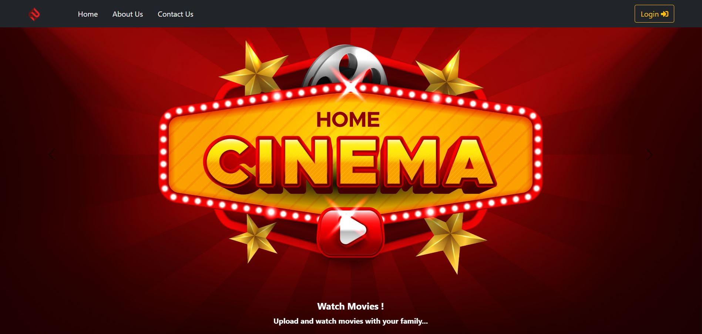
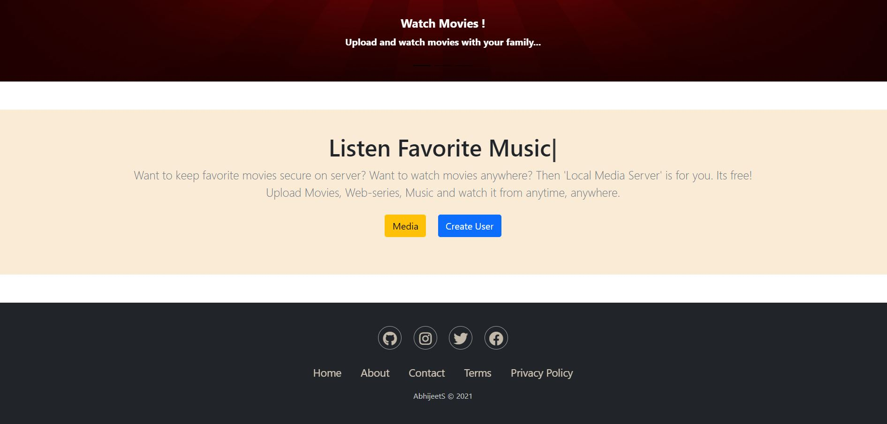
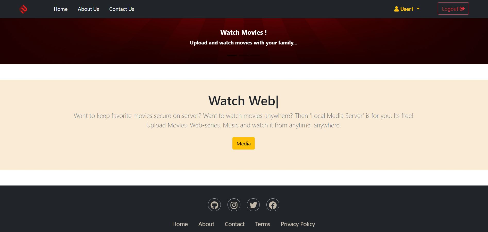
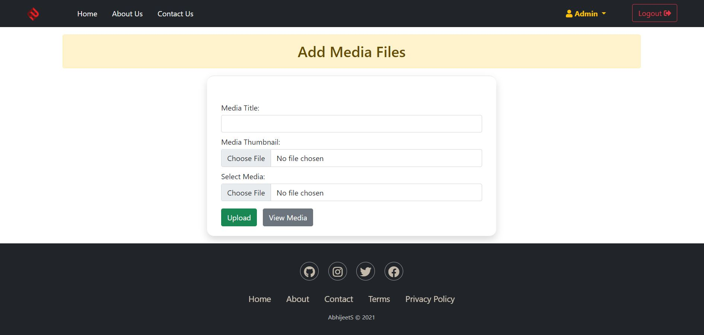
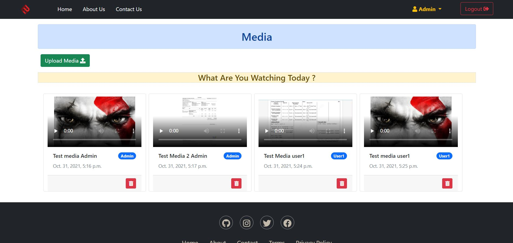

# Local Media Flix - Media Stream

Local Media Flix is a basic Media Stream site created using `Django`, `HTML`, `CSS`, `Javascript`, `Jquery`, `Bootstrap`, `Fontawesome`.


## Steps to run Django app/server

 - Clone the project
```bash
  git clone https://github.com/jacktherock/Local-Media-Flix.git
```

 - Go to main project directory where `manage.py` locates
```bash
  cd LocalMediaStream
```

 - Create database
```bash
  python manage.py makemigrations
```

 - Create tables in database
```bash
  python manage.py migrate
```

 - Create Super user (Admin)
```bash
  python manage.py createsuperuser
```

 - Run Django Server
 ```bash
  python manage.py runserver
```

Now Local Media Flix app server will run properly.

## Project images 
  - ### Home page 
    - These is how the home page looks. 
        
    ------
  - ### Admin Home page 
    - These is how the Admin home page looks. 
    - Only Admin can create a New User that's why `Create User` is only seen on Admin home.
        
    ------
  - ### User Home page 
    - These is how the User home page looks. 
    - `Create User` is not seen on User home.
        
    ------
  - ### Upload Media files 
    - Upload media files like Videos and Music
        
    ------
  - ### View All Media 
    - These is where all uploded Medias will render of all user. Only admin can see all users media files 
        
    ------


## Support
I need help on front-end and back-end for adding more features .
All types of contributions will be accepted. 


## Thank You for Visiting !!
